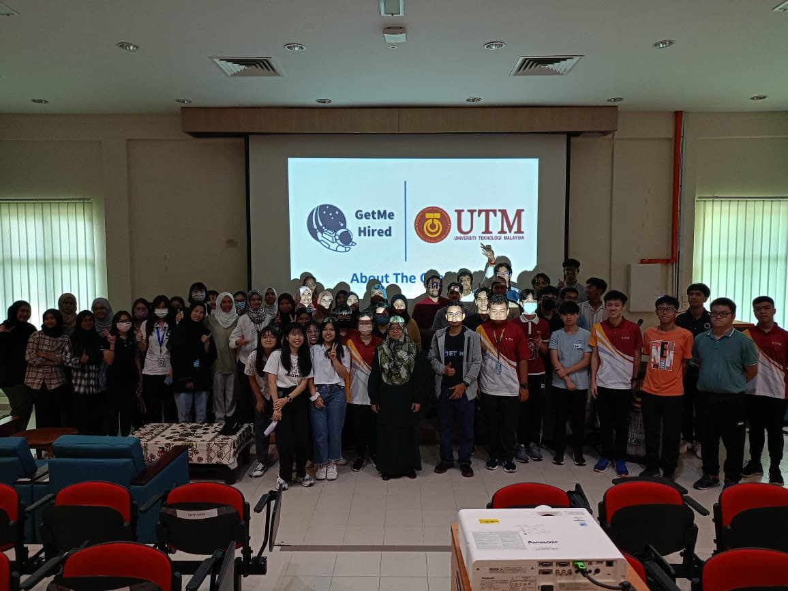

# 🎤 Industry Talk 01: PPG x GetMe Hired 2023

---

## 📌 Event Information

| Item | Details |
|------|----------|
| Event Name | PPG Industry Sharing & GetMe Hired Program |
| Date | 27 – 28 October 2023 |
| Venue | Dewan Kejora, N28A Faculty of Computing & UTM Recreational Forest |

---

## 📖 Overview

The PPG and GetMe Hired Program was organized to expose students to industry expectations, internship preparation, and career development in the field of Information and Communication Technology (ICT) and Data Engineering.

The program included sharing sessions by industry representatives from PPG Industries and alumni speakers. Topics focused on career pathways, workplace expectations, portfolio development, resume preparation, and essential professional skills.

PPG Industries is a global paint and coating manufacturing company guided by the mission **"We Protect and Beautify the World."** The company provides internship opportunities and supports career development by exposing students to real working environments and industry practices.

Key topics covered during the program included:
- Career development in ICT and Data Engineering
- Importance of professional portfolio (GitHub and LinkedIn)
- Resume and Curriculum Vitae (CV) preparation
- Internship readiness and workplace expectations
- Industry skills required for data-related careers

---

## 💭 Reflection

The program provided valuable insights into the requirements of the technology industry. Technical knowledge alone is not sufficient for career success; strong communication skills, teamwork, problem-solving abilities, and time management are equally important.

Exposure to alumni sharing sessions highlighted the importance of continuous self-improvement and active preparation for future career opportunities. Building a strong GitHub portfolio and maintaining a professional LinkedIn profile are essential strategies for career development in the modern technology industry.

Understanding of PPG Industries and its internship support system provided clearer awareness of real workplace environments and expectations. This includes professionalism, adaptability, and continuous learning in a fast-changing industry.

Overall, the program strengthened awareness of industry requirements and emphasized the importance of preparing early for internships and future employment in Data Engineering and ICT fields.

---

## 📸 Event Gallery

### PPG Industry Sharing Session

### GetMe Hired Program

### Group Photo

